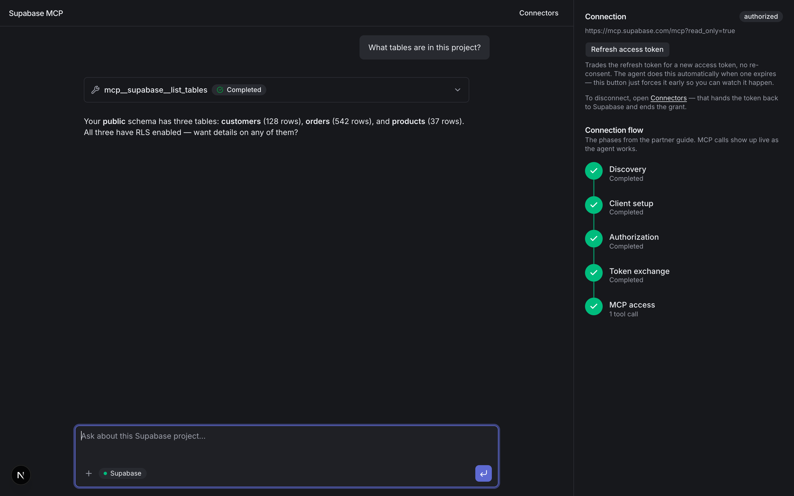
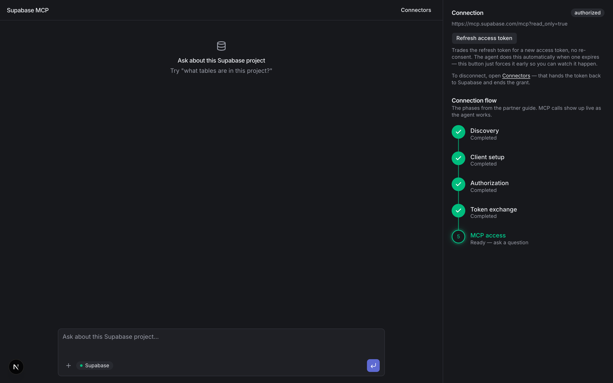
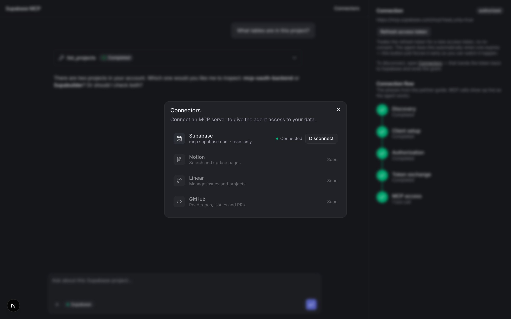

# Supabase MCP OAuth

A working reference implementation of connecting to the hosted Supabase MCP
server (`mcp.supabase.com`) over OAuth 2.1 — discovery, PKCE, dynamic client
registration, the authorize redirect, token exchange and refresh — plus a
Next.js dashboard that drives the whole flow from a "Connect" button and
lets you chat with an agent that has live access to the connected project.

It exists to validate [`supabase-mcp-connect-flow-draft.md`](supabase-mcp-connect-flow-draft.md)
against production (see [`VALIDATION.md`](VALIDATION.md) for what was
confirmed, corrected, or found broken) and to give partners something they
can actually run, not just read.



## How it fits together

```
┌───────────────────┐   HTTP API, no OAuth   ┌──────────────┐   OAuth 2.1   ┌────────────────────┐
│  dashboard/        │ ─────────────────────► │  backend/    │ ────────────► │ api.supabase.com   │
│  chat + connect UI │ ◄───────────────────── │  OAuth broker│ ◄──────────── │ (discovery, tokens)│
└─────────┬──────────┘   access token back    └──────────────┘               └────────────────────┘
          │
          │ Bearer <access token>
          ▼
┌────────────────────┐
│ mcp.supabase.com    │
│ (MCP tool calls)    │
└────────────────────┘
```

- **[`backend/`](backend)** is a client-agnostic OAuth connection broker,
  deployed as Vercel serverless functions. It owns the entire OAuth
  lifecycle — [`lib/oauth.ts`](backend/lib/oauth.ts) does discovery, PKCE,
  and dynamic client registration (with defensive re-registration around a
  stale-`client_id` bug found in production, see `VALIDATION.md`);
  [`lib/connections.ts`](backend/lib/connections.ts) orchestrates that into
  the operations the API needs — start, complete, refresh, revoke — and
  [`lib/db.ts`](backend/lib/db.ts) persists connection state to its own
  Supabase project. It exposes a small REST API
  (`GET/POST /api/connections`, `GET/DELETE /api/connections/:id`,
  `GET /api/connections/:id/token`, `POST /api/connections/:id/refresh`,
  `GET /api/oauth/callback`) with **zero knowledge of MCP tool-calling or
  which agent SDK is on the other end** — any frontend can drive it.
- **[`dashboard/`](dashboard)** is that frontend: a Next.js app that opens
  directly onto a chat panel. Its own API routes
  ([`app/api/connections/*`](dashboard/app/api/connections)) proxy to the
  backend so `BACKEND_API_TOKEN` never reaches the browser, and
  [`app/api/chat/route.ts`](dashboard/app/api/chat/route.ts) is the one
  place OAuth and the agent meet: it fetches a fresh access token from the
  backend, opens an MCP client with `@ai-sdk/mcp` using that token as a
  bearer header, and streams the conversation back with `@ai-sdk/anthropic`
  + [Vercel AI Elements](https://ai-sdk.dev/elements).

Both pieces talk to `mcp.supabase.com` and `api.supabase.com` as the OAuth
spec describes; nothing in the backend is Next.js- or Claude-specific,
including which agent SDK ends up calling the tools.

## Screenshots

|                                                            |                                                              |
| ---------------------------------------------------------- | ------------------------------------------------------------ |
|       |    |
| Opens straight onto the chat, with a live stepper for the connect flow | The "+" in the chat box opens this — connect, disconnect, see what's live |

## Environment variables

Nothing in either `.env.example` is pre-filled — every value below is yours
to create.

**`backend/.env`**

| Variable              | Where it comes from                                                                                                                                                |
| ---------------------- | -------------------------------------------------------------------------------------------------------------------------------------------------------------------- |
| `SUPABASE_URL`         | Create a new, empty Supabase project for the backend's own bookkeeping (see [Storage](#storage) below) — Project Settings → API → Project URL.                     |
| `SUPABASE_SECRET_KEY`  | Same project — Project Settings → API Keys → the **secret key** (`sb_secret_...`). Not the anon/publishable key, and not the OAuth `client_secret` from DCR.       |
| `BACKEND_API_TOKEN`    | A shared secret you invent: `openssl rand -hex 32`. Whatever it is, the same value goes in `dashboard/.env`.                                                        |
| `OAUTH_REDIRECT_URI`   | Left as the localhost default for local dev; already set in `.env.example`.                                                                                        |
| `DASHBOARD_URL`        | Left as the localhost default for local dev; already set in `.env.example`.                                                                                        |

**`dashboard/.env`**

| Variable              | Where it comes from                                                                                     |
| ---------------------- | ---------------------------------------------------------------------------------------------------------- |
| `BACKEND_URL`          | Left as the localhost default; already set in `.env.example`.                                            |
| `BACKEND_API_TOKEN`    | Must be the **exact same value** you generated for `backend/.env` above.                                 |
| `ANTHROPIC_API_KEY`    | [console.anthropic.com](https://console.anthropic.com/settings/keys) → Create Key.                        |

## Running it

```bash
# Backend
cd backend && npm install
cp .env.example .env   # fill in SUPABASE_URL, SUPABASE_SECRET_KEY, and BACKEND_API_TOKEN
npx vercel dev            # http://localhost:3000

# Dashboard, in another terminal
cd dashboard && npm install
cp .env.example .env    # BACKEND_API_TOKEN must match the backend's; add ANTHROPIC_API_KEY
npm run dev               # http://localhost:3002
```

Open `http://localhost:3002`, click the **+** in the chat box (or
**Connectors** in the header) and hit **Connect Supabase**. That redirects
your browser to Supabase's consent screen — you'll need to be an **owner or
admin** of the org you're authorizing (see constraint #2 in the draft; the
backend doesn't attempt to work around this, it's a hard requirement of the
current flow). Approve it and you land back in the dashboard, connected,
ready to ask about the project.

If `DASHBOARD_URL` isn't set on the backend, the OAuth callback falls back
to rendering a plain "Connected" page instead of redirecting into the
dashboard — useful if you're driving the backend from something other than
`dashboard/`.

Deploying the backend to Vercel is a separate step (`vercel login` /
`vercel deploy` from `backend/`) — done with an explicit confirmation since
it publishes a public URL, not part of local iteration.

## Storage

The backend's own connection/client state lives in its own Supabase
project — create one, apply [`backend/db/schema.sql`](backend/db/schema.sql)
to it, and point `SUPABASE_URL`/`SUPABASE_SECRET_KEY` at it. It's separate
from whatever Supabase project you actually authorize the MCP connection
*to*, and separate from your Anthropic account.

## Other docs in this repo

- [`VALIDATION.md`](VALIDATION.md) — what in the draft was confirmed live
  against production, what was corrected, and where production disagrees
  with the spec — including `/v1/oauth/revoke`, which isn't RFC
  7009-shaped and will 400 a spec-compliant request.
- [`supabase-mcp-connect-flow-draft.md`](supabase-mcp-connect-flow-draft.md)
  — the original draft this repo validates, unmodified.
- [`supabase-mcp-connect-flow-scalar.html`](supabase-mcp-connect-flow-scalar.html)
  — a partner-facing, Scalar-styled write-up of the flow, meant to be read
  standalone rather than alongside this code.
